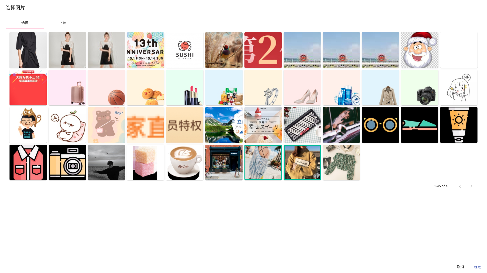

# Django Simple Attachments

基于Django的图片储存模块

## Requirements

* `sorl-thumbnail` 生成缓存图片
* `django-taggit` 图片标签
* `djangorestframework` API
* `django-extra-fields` base64字段上传


## Getting Started

### Install Packages

```
$ pip install sorl-thumbnail
$ pip install django-taggit
$ pip install django-extra-fields
$ pip install djangorestframework
$ pip install django-simple-attachments
```

### Update `settings.py`

```
INSTALLED_APPS = [
    ...
    'sorl.thumbnail',
    'taggit',
    'rest_framework',
    'attachments',
    ...
]
```

### Update `urls.py`

```
from attachments.views import media_view

urlpatterns = [
    ...
    path('api/attachments/', include('attachments.urls')),
    re_path(r'^media/attachments/(?P<path>.*)(/?)?', media_view),
    ...
]
```

## URL使用

支持`url`中对图片进行裁剪等操作, 模仿[unslash](https://unsplash.com)

```

```

### 参数说明

详细缩略图生成说明请参考`Pillow`

1. `width`, 图片最大宽度
2. `height`, 图片最大高度
3. `crop`, 裁剪形式
4. `quality`, 质量


## Fields


### ImagePickerField

单张图片选择字段, 需使用webpack打包js文件

```
from attachments.fields import ImagePickerField

class Brand(models.Model):
    name = models.CharField(max_length=200)
    logo = ImagePickerField(blank=True, null=True)
```

### MultipleImageField

多张图片选择字段, 需使用webpack打包js文件, 支持拖拽排序, ** 字段基于postgres的ArrayField, 所以必须使用postgres数据库 **

```
from attachments.fields import MultipleImageField

class Product(models.Model):
    name = models.CharField(max_length=200)
    images = MultipleImageField(size=4, blank=True, default=list)
```




### RichTextField

基于`tinymce`的富文本编辑器, 支持图片上传

使用前请下载`tinymce`

```
$ cd static
$ bower install tinymce
```

使用

```
from attachments.fields import RichTextField

class Blog(models.Model):
    title = models.CharField(max_length=200)
    content = RichTextField(blank=True, null=True)

```

## Webpack

```javascript
module.exports = {
  entry: {
    image_picker: './attachments/components/image_picker.js',
    multiple_image: './attachments/components/multiple_image.js'
  },
  output: {
    path: path.resolve('./static/dist/'),
    filename: '[name].bundle.js'
  },
  module: {
    rules: [
      {test:/\.js$/, exclude:/node_modules/, use:{
        loader: 'babel-loader',
        options: {
          presets: [['@babel/preset-env', {'targets':{'node':10}}], '@babel/preset-react']
        }
      }}
    ]
  },
}
```

## Next

* [x] 实时图片裁剪
* [x] 搜索
* [x] 标签筛选
* [x] 删除
* [x] 权限
* [ ] 图片自动标签
* [ ] 实时图片格式转换
* [ ] 自动清理


## Version

* `0.2.0` 优化图片选择操作, 增加右侧实时查看并编辑图片基础信息, 增加搜索, 标签筛选
* `0.1.0` 增加fields功能, 增加实时编辑功能
